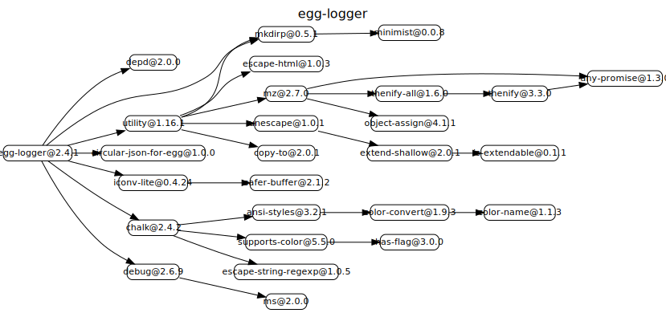
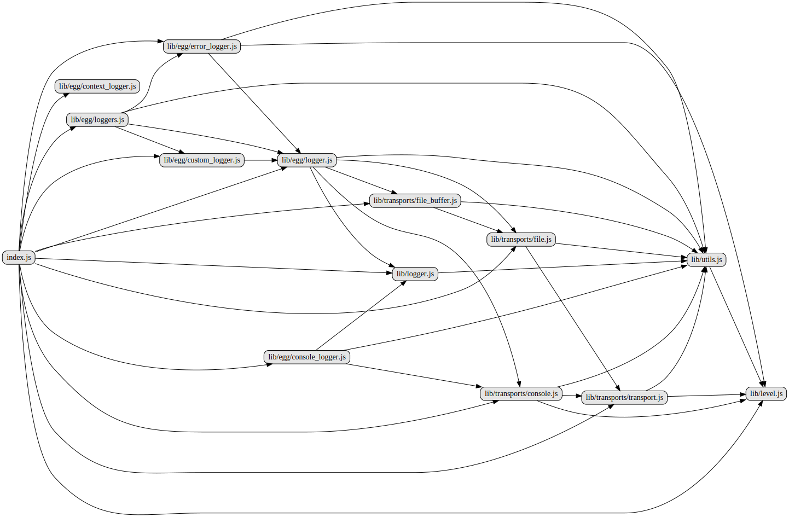
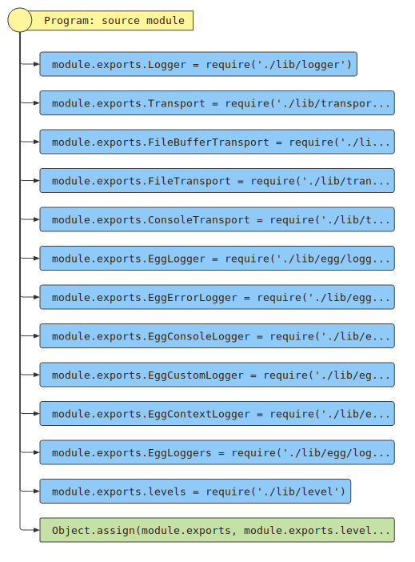

# 源码分析

## 文件结构

``` bash
├── index.d.ts - 声明文件
├── index.js - 入口文件，暴露各种模块
├── lib
|  ├── egg
|  |  ├── console_logger.js
|  |  ├── context_logger.js
|  |  ├── custom_logger.js
|  |  ├── error_logger.js
|  |  ├── logger.js
|  |  └── loggers.js
|  ├── level.js
|  ├── logger.js
|  ├── transports
|  |  ├── console.js
|  |  ├── file.js
|  |  ├── file_buffer.js
|  |  └── transport.js
|  └── utils.js
```

## 外部模块依赖



## 内部模块依赖



## 各文件分析

### index.js

入口文件，综合引用暴露出去。



