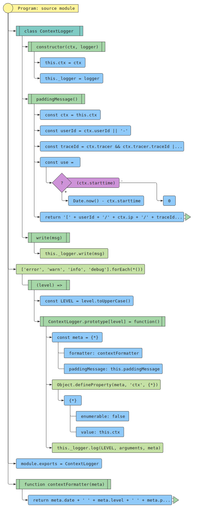

# 源码分析

## 文件结构

``` bash
├── index.d.ts - 声明文件
├── index.js - 入口文件，暴露各种模块
├── lib
|  ├── egg
|  |  ├── console_logger.js - 继承自lib/logger.js，基于console.js来设置console属性
|  |  ├── context_logger.js - 整理信息格式，调用传入的logger的log方法，分级error,warn,info,debug输出。
|  |  ├── custom_logger.js - 继承自lib/egg/logger, 啥也没做暴露空类
|  |  ├── error_logger.js - 继承自lib/egg/logger.js，增加了默认level为error
|  |  ├── logger.js - 继承自lib/logger.js，底层绑定不同的transform：files/console/file_buffer
|  |  └── loggers.js - 继承自Map对象，基于lib/egg/logger.js实例化了logger,corelogger。基于custom_logger.js实现自定义logger
|  ├── level.js
|  ├── logger.js - 封装对transport的操作
|  ├── transports
|  |  ├── console.js - 继承自lib/transports/transport.js，通过process.stdout.write和process.stderr.write的方式，写入日志内容
|  |  ├── file.js - 继承自lib/transports/transport.js，通过流的方式，写入日志内容
|  |  ├── file_buffer.js - 继承自lib/transports/file.js，区别在于写入时利用Buffer
|  |  └── transport.js - 封装了log，enable，disable等方法
|  └── utils.js
```

## 外部模块依赖


## 内部模块依赖


## 各文件分析

### index.js

入口文件，综合引用暴露出去。


### lib/egg/context_logger.js

整理信息格式，调用传入的logger的log方法，分级error,warn,info,debug输出。




### lib/egg/loggers.js

继承自Map对象，基于lib/egg/logger.js实例化了logger,corelogger。基于custom_logger.js实现自定义logger。


### lib/egg/error_logger.js

继承自lib/egg/logger.js，增加了默认level为error


### lib/egg/logger.js

继承自lib/logger.js，底层绑定不同的transform：files/console/file_buffer。


### lib/logger.js

封装对transport的操作

### lib/transports/file_buffer.js

继承自lib/transports/files.js，区别在于写入时利用Buffer。


### lib/transports/file.js

继承自lib/transports/transport.js，通过流的方式，写入日志内容。


### lib/transports/transport.js

封装了log，enable，disable等方法。


### lib/transports/console.js

继承自lib/transports/transport.js，通过process.stdout.write和process.stderr.write的方式，写入日志内容。


### lib/egg/custom_logger.js

继承自lib/egg/logger, 啥也没做暴露空类。


### lib/egg/console_logger.js

继承自lib/logger.js，基于console.js来设置console属性。


